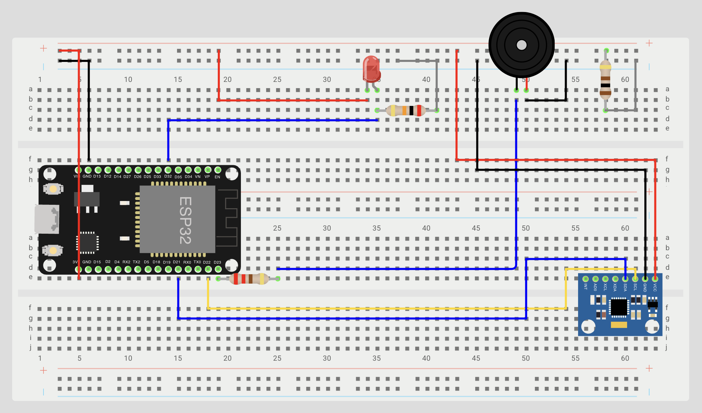
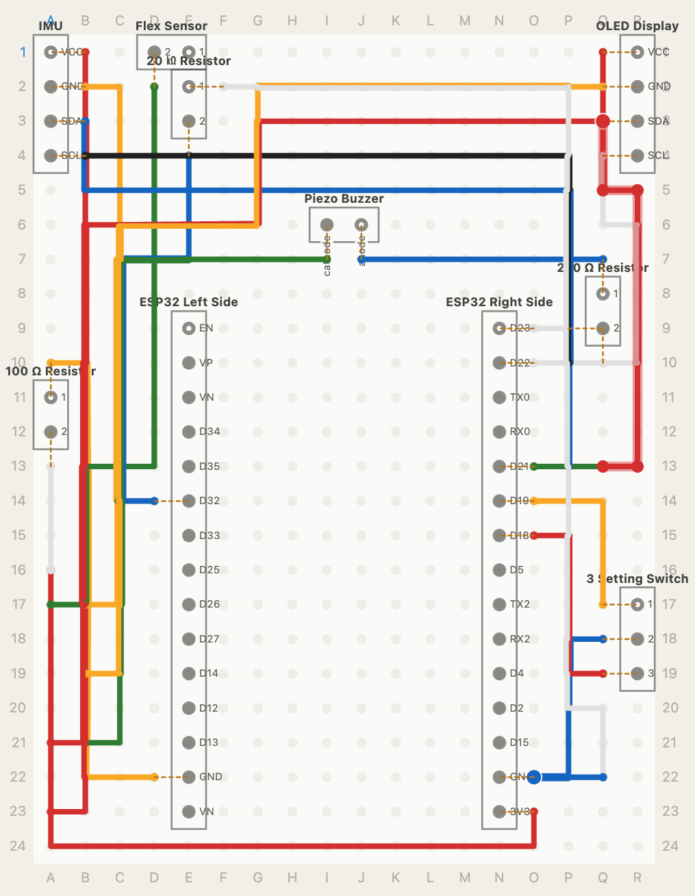

# Wrist Rehab Device
My project aims to build a wrist rehabilitation device that not only tracks when a user's wrist position is not ideal, but also tracks whether they are doing rehab exercises with proper form using the accelerometer and gyroscope. It also tracks their rehab process by using the flex sensor to track their range of motion (ROM—the angle that their wrist can bend or twist in a certain direction) and letting users see how they've improved.

| **Engineer** | **School** | **Area of Interest** | **Grade** |
|:--:|:--:|:--:|:--:|
| Ankang H | Archbishop Mitty High School | Mechanical Engineering | Incoming Senior


# Final Milestone

<iframe width="560" height="315" src="https://www.youtube.com/embed/F7M7imOVGug" title="YouTube video player" frameborder="0" allow="accelerometer; autoplay; clipboard-write; encrypted-media; gyroscope; picture-in-picture; web-share" allowfullscreen></iframe>

For your final milestone, explain the outcome of your project. Key details to include are:
- What you've accomplished since your previous milestone
- What your biggest challenges and triumphs were at BSE
- A summary of key topics you learned about
- What you hope to learn in the future after everything you've learned at BSE
-->
<iframe width="560" height="315" src="https://www.youtube.com/embed/qvfJJ2VkOt4?si=P6-qOHFYMxGg5TXk" title="YouTube video player" frameborder="0" allow="accelerometer; autoplay; clipboard-write; encrypted-media; gyroscope; picture-in-picture; web-share" referrerpolicy="strict-origin-when-cross-origin" allowfullscreen></iframe>
After strapping my breadboards to a wrist sleeve using tape and completing my third milestone, I decided to make major modifications to my project. First, rather than just sewing everything to a wrist sleeve, I decided to CAD (computer-aided design) a 3D-printed case for my project. This case would create a smooth track for the flex sensors to slide along the back of my wrist and increase the durability of the device as a whole, while also preventing the user from bending the device too far and breaking any sensors. To do this, I had to create a mechanism that would not impede the movement of the user's wrist while also setting hard limits to prevent excessive movement. I designed a mechanism with two sliders in slots and a center pin to allow for three degrees of freedom, allowing for the user to bend their wrist up and down as well as left and right while also being adjustable to different hand/forearm sizes. This hinge with multiple pivots is called a polycentric hinge, and hinges of this type are commonly used in biomedical devices.The case can be strapped onto a user's arm using three Velcro straps, much like the arm guards used in archery. I also decided to move my electronics setup from breadboards to a perfboard, which allowed the form factor to be reduced significantly. I added a switch to allow the user to switch between passive mode, which covered all of the capabilities of the base project (warning the user when their wrist was bent too far), rehab mode, which alerts users when they are performing exercises with poor form, and a light sleep mode which allows the microcontroller to save power. I also added a small 0.96-inch OLED display to display visual feedback to the user using the U8g2 library. I did add a timer to passive mode to let the user know how long they have went without bending their wrist too much. The rehab mode warns the user when their wrist is accelerating too much, as rehab exercises should be performed in a slow and controlled way. It also records personal bests for wrist flexion and extension angles. When the device is in rehab mode, it smartly detects when the user is performing an isometric exercise by detecting the micro-fluctuations in gyroscope and accelerometer readings when muscles tremor when a user performs isometrics. To do this, it sums up the fluctuations over every 4 ms over a period of 2 seconds (so 500 samples) and sees if it exceeds a certain threshold but stays under another. A large arm swing would have a very large sum, as all the gyro changes are in one direction, but as gyro values would vibrate back and forth between positive and negative values, the sum would stay closer to 0. It automatically starts a 10-second timer when the user starts doing an isometric, and if the user holds it for longer than 10 seconds, it extends the timer to 30 seconds. It also tracks how many reps of isometrics the user has done in a session and records the seconds held, including partial reps but not allowing the user to cheat the device entirely.

I had several big triumphs at BSE. First, I made a self-designed a polycentric hinge that smoothly guided the flex sensor and conformed to the wrist. Secondly, I successfully usd code to detect isometric exercises. My device can successfully differentiate between isometric exercises, large arm swings, quick arm shakes, and slow arm shifts.

Some key topics that I learned about were how to use code to make the pins on the microcontroller communicate with one another. I also learned a lot about the functions of electronic components like resistors, capacitators, and more. I learned a lot about the theory behind circuits, like how Ohm's Law is involved and how voltage divider circuits worked. I also learned how to solder circuits together and use solder flux paste.

I hope to learn a lot more about different manufacturing techniques in the future. I'd also like to learn more about how simulation software can simulate stresses experienced by a part.

I'll continue to work on this project in my own time. I'll refine the mechanical design and work on the code such that data is kept across multiple sessions. I can also incorporate a second IMU to track more complex exercises like wrist curls.

# Second Milestone

<iframe width="560" height="315" src="https://www.youtube.com/embed/5qvy2aWSr3A?si=4-eTQDZXDlAVY6ra" title="YouTube video player" frameborder="0" allow="accelerometer; autoplay; clipboard-write; encrypted-media; gyroscope; picture-in-picture; web-share" referrerpolicy="strict-origin-when-cross-origin" allowfullscreen></iframe>
For my second milestone, I managed to convert the raw readings from the flex sensor to an angle by plugging the reading into a 3rd-degree polynomial equation. To obtain this equation, I ran a test where I recorded the approximate reading returned by the sensor per interval of 10 degrees (from 0-90°) and fitting a trendline to it on Google Sheets. I then made the buzzer buzz whenever the angle measurement exceeded 20 degrees. When the wrist was bent at a greater angle, the buzzer was made to buzz faster. I had to basically revamp the structure of my code around the millis() timing system in Arduino IDE, as using delay() for the buzzer froze the entire program from running, which prevented the program from continually tracking wrist angles. I discovered that sudden jerks like the device being tapped on the table could cause flex sensor readings to jump violently (probably due to the particles inside the sensor being disrupted), so I calculated jerk (the derivative of acceleration) using the accelerometer's readings to prevent the flex sensor from reading values in the period immediately after the instant where the jerk exceeds a certain threshold.

# First Milestone

<iframe width="560" height="315" src="https://www.youtube.com/embed/u0jO5ZX_sRc?si=ZlG__jS7vmHKhhlk" title="YouTube video player" frameborder="0" allow="accelerometer; autoplay; clipboard-write; encrypted-media; gyroscope; picture-in-picture; web-share" referrerpolicy="strict-origin-when-cross-origin" allowfullscreen></iframe>
I wired up all of my sensors on the breadboard according to my wiring schematic. I actually needed to use 2 breadboards as the ESP-32 microcontroller is too wide for a single one. I had to set up a voltage divider for my flex sensor with a resistor to actually let my ESP-32 measure readings. I made my piezo buzzer buzz periodically, and my IMU (inertial measurement unit including an accelerometer, gyroscope, and magnetometer) returned acceleration and angular velocity readings. However, the acceleration measurements made by the accelerometer inside the IMU included the acceleration due to gravity, so I spent a lot of time using the Adafruit AHRS and SensorLab libraries to use a 9-DOF sensor fusion filter, NXPFusion, that combined the readings of the accelerometer, gyroscope, and magnetometer) to allow the IMU to determine its exact orientation and do some math to filter out gravity from the acceleration readings. The magnetometer was extremely prone to ambient magnetic fields, so I had to calibrate it properly in my code. I tried to get Classic Bluetooth to work, but it wasn't agreeing with my computer so I had to switch to using BLE (Bluetooth Low Energy) to establish a connection between my device and my computer for testing.

# Starter Project - Jitterbug

<iframe width="560" height="315" src="https://www.youtube.com/embed/nMMjlUX_D_o?si=9CbDTJQDhTlcbcu3" title="YouTube video player" frameborder="0" allow="accelerometer; autoplay; clipboard-write; encrypted-media; gyroscope; picture-in-picture; web-share" referrerpolicy="strict-origin-when-cross-origin" allowfullscreen></iframe>

# Schematics

# Wiring Schematic

# Perfboard Schematic


# Milestone 2 Code

```c++
#include <BLEDevice.h>
#include <BLEServer.h>
#include <BLEUtils.h>
#include <BLE2902.h>
#include <Adafruit_LSM6DS3TRC.h>
#include <Adafruit_LIS3MDL.h>
#include <Adafruit_AHRS.h>

#define SERVICE_UUID           "6E400001-B5A3-F393-E0A9-E50E24DCCA9E"
#define RX_CHARACTERISTIC_UUID "6E400002-B5A3-F393-E0A9-E50E24DCCA9E"
#define TX_CHARACTERISTIC_UUID "6E400003-B5A3-F393-E0A9-E50E24DCCA9E"

BLEServer *pServer = NULL;
BLECharacteristic *pTxCharacteristic;
bool deviceConnected = false;

Adafruit_LSM6DS3TRC lsm6ds;
Adafruit_LIS3MDL lis3mdl;
Adafruit_NXPSensorFusion filter;

const int FLEX_PIN = 32;
const int buzzer = 23;

const int STRAIGHT_FLEX_READING = 2410; // Flex sensor measurement when straight
const int BENT_FLEX_READING = 1770; // Flex sensor measurement when bent at 90 degrees at approximately the same curvature as my wrist
float flexAngle = 0;

unsigned long lastPrintTime = 0;
unsigned long lastFilterUpdate = 0;
unsigned long buzzerCycleTime = 0;

sensors_event_t accel, gyro, mag, temp;

float accelX = 0, accelY = 0, accelZ = 0;
float tareX = 0, tareY = 0, tareZ = 0;
float cleanX = 0, cleanY = 0, cleanZ = 0;
bool isCalibrated = false;
unsigned long startCal = 4000;
unsigned long endCal = 6000;
float tareSumX = 0.0, tareSumY = 0.0, tareSumZ = 0.0;
float tareNum = 0.0;
float accelValue = 0;
float smoothedJerk = 0;

#define MAG_HARD_IRON_X -44.56
#define MAG_HARD_IRON_Y 33.52
#define MAG_HARD_IRON_Z 7.34

const float G = 9.80665; // Acceleration due to gravity on Earth

class MyServerCallbacks: public BLEServerCallbacks {
    void onConnect(BLEServer* pServer) {
      deviceConnected = true;
    };
    void onDisconnect(BLEServer* pServer) {
      deviceConnected = false;
      pServer->getAdvertising()->start(); // Restart advertising so ESP-32 can reconnect without resetting the board
    }
};

void setup() {
  Serial.begin(9600);

  Wire.begin();
  
  BLEDevice::init("AK_ESP32_Bluetooth");
  pServer = BLEDevice::createServer();
  pServer->setCallbacks(new MyServerCallbacks());

  BLEService *pService = pServer->createService(SERVICE_UUID);

  pTxCharacteristic = pService->createCharacteristic(TX_CHARACTERISTIC_UUID, BLECharacteristic::PROPERTY_NOTIFY);
  pTxCharacteristic->addDescriptor(new BLE2902());

  BLECharacteristic *pRxCharacteristic = pService->createCharacteristic(RX_CHARACTERISTIC_UUID, BLECharacteristic::PROPERTY_WRITE);

  pService->start();
  pServer->getAdvertising()->start();
  Serial.println("BLE UART is ready and advertising!");
  
  lsm6ds.begin_I2C();
  lis3mdl.begin_I2C();

  delay(100);

  lsm6ds.setAccelDataRate(LSM6DS_RATE_208_HZ);
  lsm6ds.setGyroDataRate(LSM6DS_RATE_208_HZ);
  filter.begin(200); // Makes the sensor fusion algorithm make a calculation every 100 Hz

  pinMode(FLEX_PIN, INPUT);
  pinMode(buzzer, OUTPUT);
}

void loop() {
  static float lastAccelValue = 0;
  static float jerk = 0;
  
  if (millis() - lastFilterUpdate >= 4) {
    lastFilterUpdate += 4;

    lsm6ds.getEvent(&accel, &gyro, &temp);
    lis3mdl.getEvent(&mag);

    filter.update(gyro.gyro.x * 180.0 / PI, gyro.gyro.y * 180.0 / PI, gyro.gyro.z * 180.0 / PI, accel.acceleration.x / G, accel.acceleration.y / G, accel.acceleration.z / G, mag.magnetic.x - MAG_HARD_IRON_X, mag.magnetic.y - MAG_HARD_IRON_Y, mag.magnetic.z - MAG_HARD_IRON_Z);
    filter.getLinearAcceleration(&accelX, &accelY, &accelZ);

    cleanX = accelX * G - tareX;
    cleanY = accelY * G - tareY;
    cleanZ = accelZ * G - tareZ;

    const float deadzone = 0.2;

    float rawAccelValue = sqrt(cleanX * cleanX + cleanY * cleanY + cleanZ * cleanZ);
    jerk = abs(rawAccelValue - lastAccelValue);
    smoothedJerk = (0.5 * smoothedJerk) + (0.5 * jerk);
    
    if ((abs(jerk) < 0.1 && rawAccelValue < deadzone) || rawAccelValue < deadzone) {
      accelValue = 0;
    } else {
      accelValue = rawAccelValue;
    }
    lastAccelValue = rawAccelValue;

    if (accelValue == 0) smoothedJerk = 0;

    static unsigned long lockoutEndTime = 0;

    if (smoothedJerk > 0.5) lockoutEndTime = millis() + 100;
    
    if (millis() >= lockoutEndTime) {
      int rawFlex = analogRead(FLEX_PIN);
      float rawFlexAngle = 1621 - 1.58 * rawFlex + 0.000481 * pow(rawFlex, 2) - 0.000000043 * pow(rawFlex, 3);
      flexAngle = constrain(((int)((((rawFlexAngle - 5.0027) * 90) / 87.87718) * 100) / 100.0), 0, 180);
    }
  }

  if (!isCalibrated && millis() >= startCal) {
    tareSumX += cleanX; tareSumY += cleanY; tareSumZ += cleanZ;
    tareNum++;
    if (millis() >= endCal) {
      tareX = tareSumX / tareNum;
      tareY = tareSumY / tareNum;
      tareZ = tareSumZ / tareNum;
      isCalibrated = true;
    }
  }

  if (millis() - lastPrintTime >= 500) {
    lastPrintTime = millis();

    Serial.println("Flex: " + String(flexAngle) + " degrees");
    Serial.println("Flex RAW: " + String(analogRead(FLEX_PIN)));

    Serial.print("Acceleration: "); Serial.println(String(accelValue) + " m/s^2");
    Serial.print("Accel X: "); Serial.print(cleanX);
    Serial.print(" | Y: ");    Serial.print(cleanY);
    Serial.print(" | Z: ");    Serial.print(cleanZ);
    Serial.println(" m/s^2");

    Serial.print("Gyro X: ");  Serial.print(gyro.gyro.x);
    Serial.print(" | Y: ");    Serial.print(gyro.gyro.y);
    Serial.print(" | Z: ");    Serial.print(gyro.gyro.z);
    Serial.println(" rad/s");

    String bluetoothData = "";

    bluetoothData += ("Flex: " + String(flexAngle) + " degrees\n");
    bluetoothData += ("Accel X: " + String(cleanX) + " | Y: " + String(cleanY) + " | Z: " + String(cleanZ) + " m/s^2\n");
    bluetoothData += ("Gyro X: " + String(gyro.gyro.x) + " | Y: " + String(gyro.gyro.y) + " | Z: " + String(gyro.gyro.z) + " rad/s\n");

    if (deviceConnected) {
      pTxCharacteristic->setValue(String(bluetoothData).c_str());
      pTxCharacteristic->notify(); // Pushes data out immediately
    }
  }
  
  static int buzzerMode = 0;
  static int currAngle = 0;
  static unsigned long buzzerDelay = 450;

  if (flexAngle > 20 || buzzerMode != 0) {
    if (buzzerMode == 0) {
      buzzerCycleTime = millis();
      tone(buzzer, 6000);
      currAngle = flexAngle;
      buzzerDelay = (map(constrain(currAngle, 20, 90), 20, 90, 450, 150) + 12) / 25 * 25;
      buzzerMode = 1;
    } else if (buzzerMode == 1 && millis() - buzzerCycleTime > buzzerDelay) {
        tone(buzzer, 100);
        buzzerMode = 2;
    } else if (buzzerMode == 2 && millis() - buzzerCycleTime > buzzerDelay * 2) {
      noTone(buzzer);
      buzzerMode = 0;
    }
  } else {
    if (buzzerMode != 0) {
      noTone(buzzer);
      buzzerMode = 0; // Resets the buzzer so noTone() isn't spammed
    }
  }

  yield();
}
```

# Milestone 1 Code

```c++
#include <BLEDevice.h>
#include <BLEServer.h>
#include <BLEUtils.h>
#include <BLE2902.h>
#include <Adafruit_LSM6DS3TRC.h>
#include <Adafruit_LIS3MDL.h>
#include <Adafruit_AHRS.h>

#define SERVICE_UUID           "6E400001-B5A3-F393-E0A9-E50E24DCCA9E"
#define RX_CHARACTERISTIC_UUID "6E400002-B5A3-F393-E0A9-E50E24DCCA9E"
#define TX_CHARACTERISTIC_UUID "6E400003-B5A3-F393-E0A9-E50E24DCCA9E"

BLEServer *pServer = NULL;
BLECharacteristic *pTxCharacteristic;
bool deviceConnected = false;

Adafruit_LSM6DS3TRC lsm6ds;
Adafruit_LIS3MDL lis3mdl;
Adafruit_NXPSensorFusion filter;

const int FLEX_PIN = 32;
const int buzzer = 23;

unsigned long lastPrintTime = 0;
unsigned long lastFilterUpdate = 0;
unsigned long buzzerCycleTime = 0;

sensors_event_t accel, gyro, mag, temp;

float accelX = 0, accelY = 0, accelZ = 0;
float tareX = 0, tareY = 0, tareZ = 0;
bool isCalibrated = false;

// Defines offset for magnetometer
#define MAG_HARD_IRON_X -44.56
#define MAG_HARD_IRON_Y 33.52
#define MAG_HARD_IRON_Z 7.34

class MyServerCallbacks: public BLEServerCallbacks {
    void onConnect(BLEServer* pServer) {
      deviceConnected = true;
    };
    void onDisconnect(BLEServer* pServer) {
      deviceConnected = false;
      pServer->getAdvertising()->start(); // Restart advertising so ESP-32 can reconnect without resetting the board
    }
};

void setup() {
  Serial.begin(9600);

  Wire.begin();
  
  BLEDevice::init("AK_ESP32_Bluetooth");
  pServer = BLEDevice::createServer();
  pServer->setCallbacks(new MyServerCallbacks());

  BLEService *pService = pServer->createService(SERVICE_UUID);

  pTxCharacteristic = pService->createCharacteristic(TX_CHARACTERISTIC_UUID, BLECharacteristic::PROPERTY_NOTIFY);
  pTxCharacteristic->addDescriptor(new BLE2902());

  BLECharacteristic *pRxCharacteristic = pService->createCharacteristic(RX_CHARACTERISTIC_UUID, BLECharacteristic::PROPERTY_WRITE);

  pService->start();
  pServer->getAdvertising()->start();
  Serial.println("BLE UART is ready and advertising!");
  
  lsm6ds.begin_I2C();
  lis3mdl.begin_I2C();
  lsm6ds.setAccelDataRate(LSM6DS_RATE_208_HZ);
  lsm6ds.setGyroDataRate(LSM6DS_RATE_208_HZ);
  filter.begin(200); // Makes the sensor fusion algorithm make a calculation every 100 Hz

  pinMode(FLEX_PIN, INPUT);
  pinMode(buzzer, OUTPUT);
}

void loop() {
  buzzerCycleTime = millis() % 2500;

  if (millis() - lastFilterUpdate >= 5) {
    lastFilterUpdate += 5;

    lsm6ds.getEvent(&accel, &gyro, &temp);
    lis3mdl.getEvent(&mag);

    filter.update(gyro.gyro.x * 180.0 / PI, gyro.gyro.y * 180.0 / PI, gyro.gyro.z * 180.0 / PI, accel.acceleration.x / 9.80665, accel.acceleration.y / 9.80665, accel.acceleration.z / 9.80665, mag.magnetic.x - MAG_HARD_IRON_X, mag.magnetic.y - MAG_HARD_IRON_Y, mag.magnetic.z - MAG_HARD_IRON_Z);
    filter.getLinearAcceleration(&accelX, &accelY, &accelZ);
  }

  if (!isCalibrated && millis() >= 3000) {
    tareX = accelX * 9.80665;
    tareY = accelY * 9.80665;
    tareZ = accelZ * 9.80665;
    isCalibrated = true;
  }

  if (millis() - lastPrintTime >= 500) {
    lastPrintTime = millis();

    int flexValue = analogRead(FLEX_PIN);

    float cleanX = accelX * 9.80665 - tareX;
    float cleanY = accelY * 9.80665 - tareY;
    float cleanZ = accelZ * 9.80665 - tareZ;

    Serial.println("Flex: " + String(flexValue));

    Serial.print("Accel X: "); Serial.print(cleanX);
    Serial.print(" | Y: ");    Serial.print(cleanY);
    Serial.print(" | Z: ");    Serial.print(cleanZ);
    Serial.println(" m/s^2");

    Serial.print("Gyro X: ");  Serial.print(gyro.gyro.x);
    Serial.print(" | Y: ");    Serial.print(gyro.gyro.y);
    Serial.print(" | Z: ");    Serial.print(gyro.gyro.z);
    Serial.println(" rad/s");

    String bluetoothData = "";

    bluetoothData += ("Flex: " + String(flexValue) + "\nAccel X: " + String(cleanX) + " | Y: " + String(cleanY) + " | Z: " + String(cleanZ) + " m/s^2\nGyro X: " + String(gyro.gyro.x) + " | Y: " + String(gyro.gyro.y) + " | Z: " + String(gyro.gyro.z) + " rad/s\n");

    if (deviceConnected) {
      pTxCharacteristic->setValue(String(bluetoothData).c_str());
      pTxCharacteristic->notify(); // Pushes data out immediately
    }
  }
  
  static int buzzerMode = 0;
  // Makes buzzer beep at 6 kHz for 175 ms then 50 Hz for 175 ms 4 times, then repeats this sequence after 1100 ms of silence
  if (buzzerCycleTime < 1400) {
    if (buzzerCycleTime % 350 < 175) {
      if (buzzerMode != 1) {
        tone(buzzer, 6000, 175);
        buzzerMode = 1;
      }
    } else {
      if (buzzerMode != 2) {
        tone(buzzer, 50, 175);
        buzzerMode = 2;
      }
    }
  } else {
    if (buzzerMode != 0) {
      noTone(buzzer);
      buzzerMode = 0;
    }
  }

  yield();
}
```

# Bill of Materials

| **Part** | **Note** | **Price** | **Link** |
|:--:|:--:|:--:|:--:|
| ESP32 | The "brain" of the device | $8.54 | <a href="https://www.amazon.com/Arduino-A000066-ARDUINO-UNO-R3/dp/B008GRTSV6/](https://www.amazon.com/ESP-WROOM-32-Development-Microcontroller-Integrated-Compatible/dp/B0DF2YJSHN/)"> Link </a> |

# Other Resources/Examples

- [How to use the LSM6DS accelerometer in the LSM6DS3TR-C+LIS3MDL IMU](https://adafruit.github.io/Adafruit_LSM6DS/html/class_adafruit___l_s_m6_d_s3.html)
- [How to use the U8g2 library with OLED displays](https://github.com/olikraus/u8g2/wiki/setup_tutorial)
- [How to use millis() in Arduino IDE](https://forum.arduino.cc/t/using-millis-for-timing-a-beginners-guide/483573)
